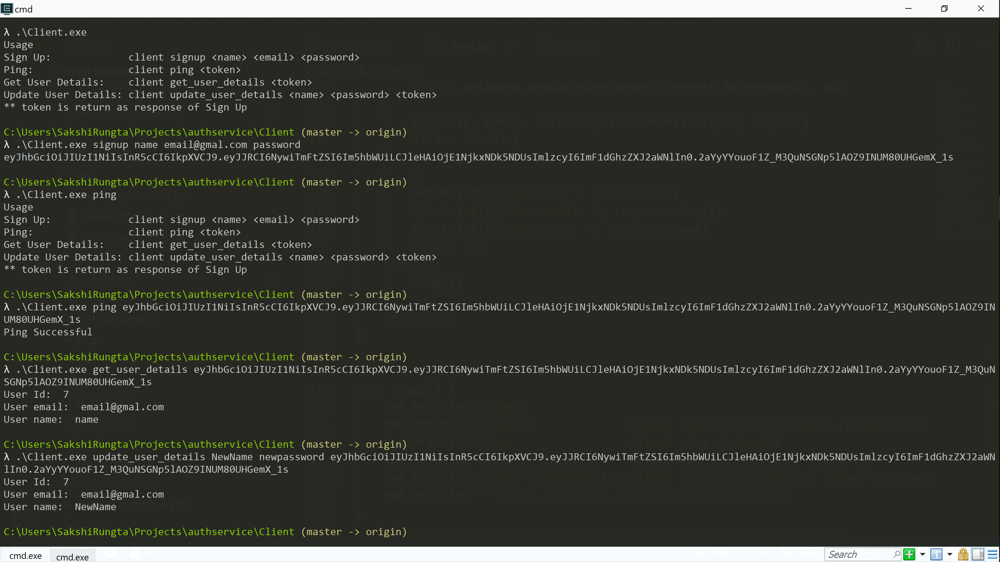

# Go gRPC JWT Authentication
The module `authservice` is built in Golang using gRPC to demonstrate JWT authentication. It exposes 4 RPCs:

1. SignUp: A user can signup by providing name, email and password. The user is authenticated using JWT and an access token is returned as response.
2. Ping: A user can test their JWT authentication via Ping. A valid token should be set as gRPC metadata for request to be successful.
3. GetUserDetails: An authenticated user can fetch their details.
4. UpdateUserDetails: An authenticated user can update their name and password.

To run the service, run `docker-compose up` in the directory where the code is cloned.

To test this service I have built a gRPC client (./client) which can be used as shown below

```
Usage
Sign Up:             client signup {name} {email} {password}
Ping:                client ping {token}
Get User Details:    client get_user_details {token}
Update User Details: client update_user_detais {name} {password} {token}
** token is returned as response of Sign Up
```

Refer to the image for example

